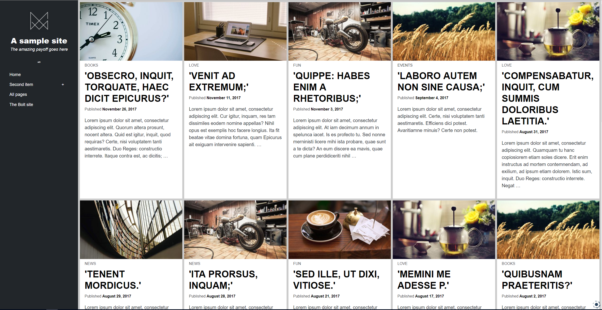

# Kuhn

Kuhn is a theme based on CSS Grid layout designed and developed by [Morten Rand-Hendriksen](https://mor10.com) and ported to Bolt. Kuhn is hyper-opinionated and developed to take advantage of modern CSS. It was developed for mor10.com and is released as a showcase of what CSS Grid can do for theme layouts.

**Note:**  This is for Bolt 3.

### Configuration

- Add the theme to the `config.yml` in the `theme: themeName` option. `themeName` is set to base-2016 by default on Bolt 3.

### Licenses and External Assets
Kuhn is distributed under the terms of the GNU GPL v2

### Namesake
Kuhn is named after philosopher [Thomas Kuhn](https://en.wikipedia.org/wiki/Thomas_Kuhn), who first introduced the concept of "paradigm shifts", one of the most frequently used and widely misunderstood philosophical terms of our time.
